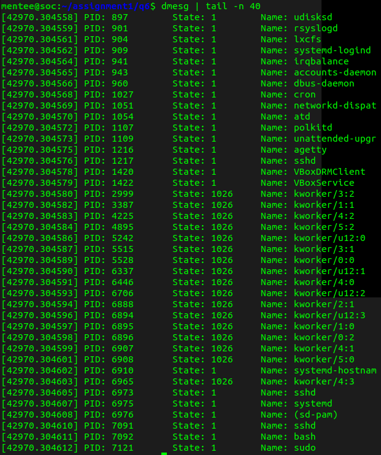

# Answers to Question 1
## Part a
`processor` refers to the identifier of the logical processor whose details are being displayed. `cpu cores` refers to the number of CPU cores available in the system. 
A system may have more logical processors than CPU cores because of hyperthreading.

## Part b
**Command Used:** `less /proc/cpuinfo` 
6 cores

## Part c
**Command Used:** `less /proc/cpuinfo` 
6 logical processors

## Part d
**Command Used:** `less /proc/cpuinfo` 
2611.198 MHz, 2611.198 MHz, 2611.198 MHz, 2611.198 MHz, 2611.198 MHz, 2611.198 MHz

## Part e
**Command Used:** `lscpu` 
x86_64

## Part f
**Command Used:** `less /proc/meminfo` 
4040504 kB

## Part g
**Command Used:** `less /proc/meminfo` 
3139776 kB

## Part h
**Command Used:** `less /proc/stat` 
Total number of forks: 3766
Total number of context switches: 2580360

# Answers to Question 2
## Part a
3832

## Part b
CPU% Consumed: 113
Mem% Consumed: 0.0

## Part c
Running

# Answer to Question 3
In `memory1`, the VSZ is 8296 kB, whereas the RSS is just 816 kB. This is because even though the array is created, its elements are never accessed. Thus, following the practice of demand paging, the lazy allocation policy of the OS never actually generates physical pages for the array thus keeping the RSS low. 
In `memory2`, the VSZ is 8304 kB, but the RSS is 3288 kB, about half the VSZ. This is because half the array is actually being touched, so the OS would have allocated physical pages for them and hence the increase in RSS. Note that for the latter half which is untouched, the OS still does not allocated physical pages for (most of) them, and hence the RSS is still only about half the VSZ.

# Question 6: Screenshot of Execution of `process_list`
